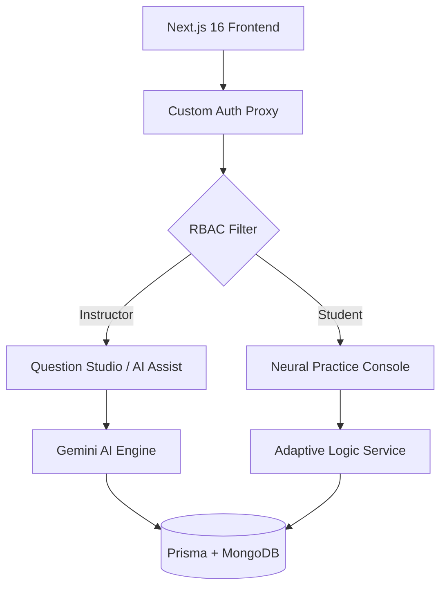

#  GO: Neural Adaptive Learning

> **The next evolution of intelligence-driven education.** 
> A production-grade, minimalist luxury adaptive learning platform designed to optimize student progression through real-time calibration and AI-driven content generation.

[](https://vercel.com)
[](https://nextjs.org)
[](https://www.mongodb.com)

---

## 💎 Visual Identity & Design Philosophy

**Go** is built on the principle of **Minimalist Luxury**. We avoid the clutter of traditional LMS platforms in favor of a "Command Console" experience:
- **High-Energy Interactions**: Butter-smooth transitions powered by Framer Motion.
- **Glassmorphism UI**: Deep blacks, subtle borders, and neon accents (`#BFFF00`).
- **Mobile-First Core**: Bento-grid layouts optimized for high-density information display on small viewports.
- **Typography**: Precision tracking and uppercase headers for a technical, high-performance feel.

---

## 🧠 The "Neural Flow" Engine

At the heart of **Go** is a sophisticated adaptive logic system that treats every student attempt as a data point for calibration.

### Adaptive Calibration Matrix
The system analyzes the last **5 attempts** to calculate the next optimal difficulty node:

| Performance Vector | Difficulty Shift | Logic |
| :--- | :--- | :--- |
| **Accuracy > 70%** | `↑ ESCALATE` | If solving easily, push the cognitive boundary to the next tier. |
| **Accuracy < 40%** | `↓ CALIBRATE` | If struggling, drop difficulty to rebuild foundational confidence. |
| **40% - 70%** | `→ STABILIZE` | Stay in the "Zone of Proximal Development" for optimal retention. |

---

## 🛠️ Key Capabilities

### 1. Question Studio (Instructor)
A high-throughput environment for content creation.
- **AI Assist**: Powered by **Gemini 2.5 Flash**, capable of generating up to 20 questions from a single prompt.
- **Batch Import**: One-click deployment of AI-generated sets into the production repository.
- **Logic Preview**: Real-time validation of AI-generated content before it goes live.

### 2. Practice Console (Student)
A focused, distraction-free interface for high-performance practice.
- **Adaptive Routing**: No manual selection; the system serves the right question at the right time.
- **Performance Analytics**: Instant feedback and accuracy tracking.

### 3. Smart Proxy Security
A custom-built `proxy.ts` layer ensures role-based access control (RBAC) across all routes, preventing cross-tenant access between students and instructors.

---

## 🏗️ Technical Architecture



- **Stack**: Next.js 16 (Turbopack), Tailwind CSS v4, Prisma 7, MongoDB Atlas.
- **AI**: Google Generative AI (Gemini SDK).
- **Styling**: Curated HSL color palette with custom dark-mode utility classes.

---

## 🚦 Getting Started

### Prerequisites
- Node.js 20.x or higher
- MongoDB Atlas cluster
- Google Gemini API Key

### Quick Start
1. **Clone & Install**:
   ```bash
   git clone https://github.com/youruser/go.git
   cd go && npm install
   ```
2. **Environment Configuration**:
   ```bash
   cp .env.example .env
   # Add your DATABASE_URL, JWT_SECRET, and GEMINI_API_KEY
   ```
3. **Database Preparation**:
   ```bash
   npx prisma db push
   ```
4. **Launch Console**:
   ```bash
   npm run dev
   ```

---

## 🧪 Quality Assurance

We maintain a strict testing suite to ensure the "Neural Flow" remains accurate.

> [!TIP]
> Run `npm run test` to verify the adaptive calibration matrix before deploying new logic.

Made by -Sarthak Roy
